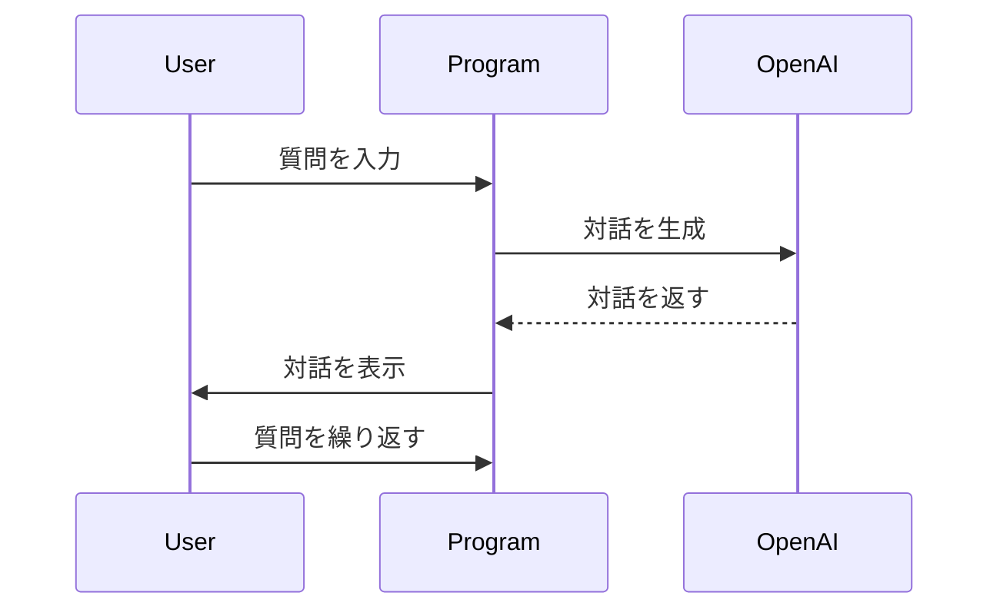

# OpenAI APIテスト

このプログラムはOpenAI APIを利用しての対話生成をテストするためのプログラムです。

## インストールと実行方法

1. このリポジトリをクローンするか、zipファイルとしてダウンロードして解凍してください。

2. コマンドラインでディレクトリ `openai-api-test` に移動し、以下のコマンドを実行してください。

```bash
npm install
```

3. `.env` ファイルを作成し、以下のようにOpenAIのAPIキーを設定してください。

```
OPENAI_API_KEY=XXXXXXXXXXXXXXXXXXXXXXXXXXXXXXXXXXXXXXXXXXXXXXXXXXXXXXXXXXXXXXXXXXXXXXXXXXXXXXXXXXXXXXXXXXXXXXXXXXXXXXXXXXXX
```

4. 以下のコマンドを実行して、プログラムを起動してください。

```bash
npm start
```

5. 対話生成のテストを行います。プログラムに質問を入力すると、OpenAI APIが対話の続きを生成して返します。終了する場合は `終了` と入力してください。

## ファイル構成

```
└──openai-api-test
    ├──README.md
       ├──index.ts
       ├──package-lock.json
       └──package.json
```

- `README.md` : このファイルです。
- `index.ts` : プログラムのメインの実行ファイルです。
- `package-lock.json` : npmパッケージの依存関係のロックファイルです。
- `package.json` : npmパッケージの依存関係とスクリプトを定義するファイルです。

## 実行の流れ

OpenAI APIテストの実行の流れ

